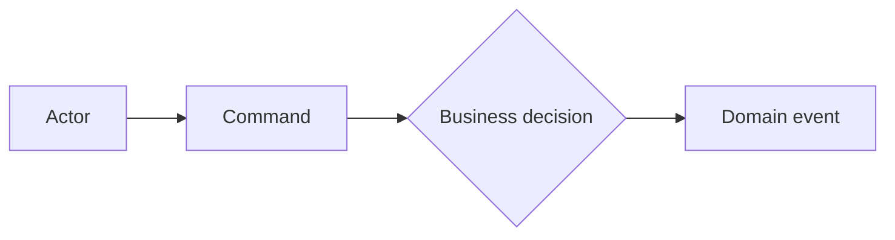

# Domain-model report template

Output structure for Step 7 of [SKILL.md](../SKILL.md). Sections that the analysis's purpose makes irrelevant may be dropped; every section that appears follows this shape.

When the analysis extracts from an existing system, tag sections and diagrams `[IMPL]` (current implementation model) or `[DOM]` (proposed domain model), tagging individual statements or rows only where they diverge from their section's tag, and give lifecycle and model sections one of each where the two differ — the separation Step 2 mandates renders through this notation.

````markdown
# Domain Model: <Domain>

## 1. Scope

### Modeling objective
### In scope
### Out of scope
### Sources

## 2. Domain overview

A concise explanation of the domain and its primary business purpose,
anchored by a domain vision statement: what the core domain is and the
value it brings, ignoring whatever does not distinguish this model from
others ([strategic-patterns.md § Distillation](strategic-patterns.md#distillation)).

## 3. Actors and goals

| Actor | Goal | Responsibilities |
|---|---|---|

## 4. Ubiquitous language

| Term | Definition | Context | Confidence |
|---|---|---|---|

### Terminology conflicts

Synonyms merged (with the evidence of equivalence) and homonyms kept apart
(with the contexts that separate them).

## 5. Key domain scenarios

### Scenario: <name>

Actor:
Trigger:
Flow:
1.
Rules:
Outcome:
Grade / Source:

## 6. Commands and domain events



## 7. Business rules

| ID | Rule | Classification(s) | Participating concepts | Grade | Source | Confidence |
|---|---|---|---|---|---|---|

One row per rule; this table is every rule's single home. A dual-face
rule (Step 4's one entry, two faces) is one row listing both
classifications with a note linking its faces; when the faces differ in
grade or confidence, give per-face values in those cells. Group or
index rows by classification below the table only as a reading aid.

## 8. Domain concepts

| Concept | Responsibility | Candidate type | Distillation | Confidence |
|---|---|---|---|---|

Candidate type: Entity, Value Object, Aggregate, Domain Service, Policy,
or plain domain concept. Distillation: core, supporting, or generic —
the highlighted core is what this column makes effortless to see.

## 9. Candidate domain model

```mermaid
classDiagram
```

Every Aggregate candidate appears in the documentation format of
[tactical-patterns.md](tactical-patterns.md): responsibility, root,
invariants, contained concepts, external references.

## 10. Bounded context candidates

```mermaid
flowchart LR
```

For every context:

```markdown
### Recruiting

Purpose: manage candidate evaluation and hiring decisions.

Core concepts:
- Candidate
- Application

Key rules:
Language:
Upstream dependencies:
Downstream consumers:

Evidence for the boundary:
```

## 11. Context relationships

Known information flows and dependencies — the existing terrain — each
labeled with what it supplies and its character (upstream–downstream,
mutually dependent, free). Context-mapping pattern names appear where
their evidence criteria are met
([strategic-patterns.md § Context-map patterns](strategic-patterns.md#context-map-patterns));
when no pattern's criteria are met, say so and why — the absence of a
label is a recorded conclusion, not silence. Proposals to change a
relationship go to section 16.

## 12. Model validation

### Scenarios tested
### Invariants checked
### Boundary challenges
### Weak points

## 13. Open questions

### High impact
### Medium impact
### Low impact

## 14. Assumptions and hypotheses

| Statement | Type | Confidence | Validation method |
|---|---|---|---|

## 15. Modeling decisions

One record per non-obvious decision:

```text
DECISION:
Treat Application and Selection as separate concepts.

REASON:
An application exists before selection begins and may terminate
without entering selection.

ALTERNATIVES:
Model Selection as the lifecycle of Application.

CONFIDENCE:
medium
```

## 16. Recommended next steps

Only actions that would materially improve the model.
````
